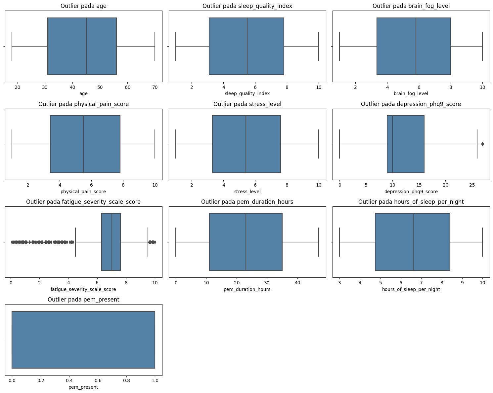
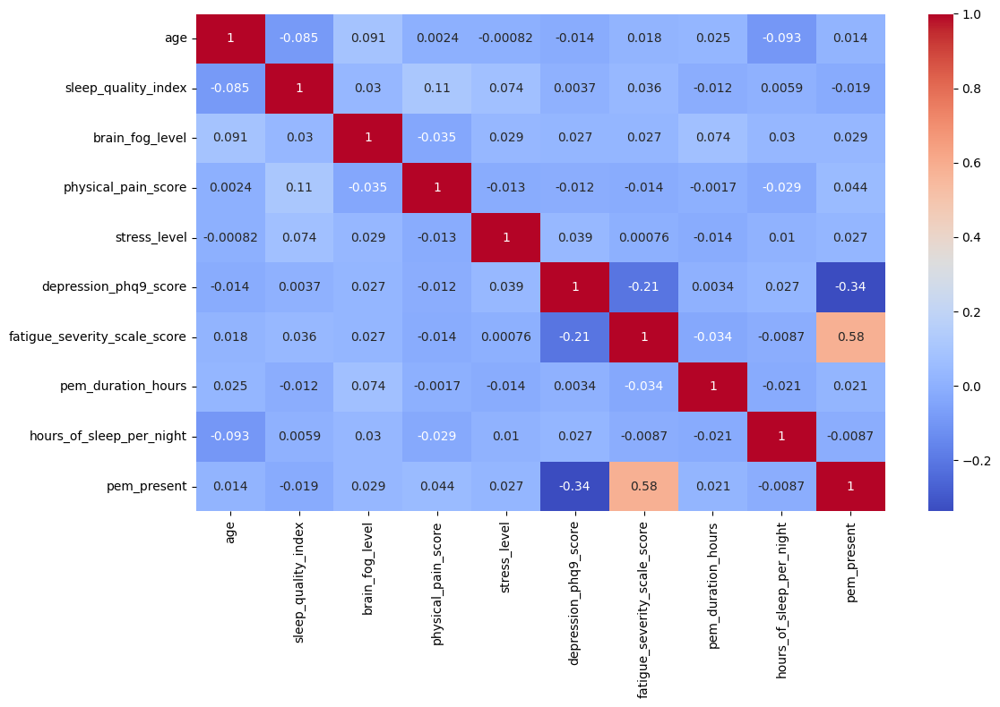
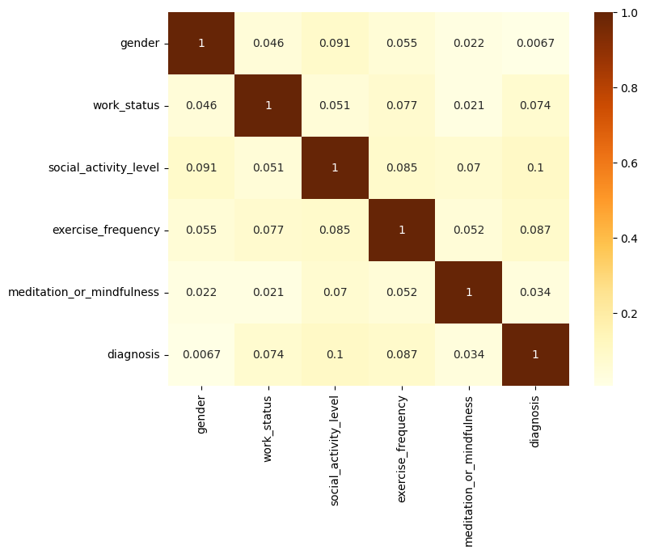

# Laporan Proyek Machine Learning - Bela Ismawati Nuraisa

## Domain Proyek

Depresi dan _Myalgic Encephalomyelitis/Chronic Fatigue Syndrome_ (ME/CFS) saling berkaitan dan dapat memperburuk kondisi satu sama lain. Depresi merupakan kondisi kesehatan mental yang memengaruhi perasaan, cara berpikir, dan kemampuan seseorang dalam menjalani aktivitas sehari-hari. Depresi klinis ditandai dengan perasaan sedih yang terus menerus, putus asa, dan hilangnya minat terhadap aktivitas yang sebelumnya disukai. Sedangkan ME/CFS mengacu pada rasa lelah yang terus-menerus, tidak membaik meskipun sudah beristirahat, dan tidak dapat dijelaskan oleh kondisi medis yang mendasarinya. ME/CFS ditandai dengan _post-exertional malaise_ (PEM), tidur yang tidak berkualitas, gangguan kognitif atau _brain fog_, intoleransi ortostatik (gejala yang memburuk saat berdiri tegak), dan nyeri (termasuk sakit kepala, nyeri otot, dan nyeri sendi).

Depresi dan ME/CFS memiliki beberapa gejala yang tumpang tindih, sehingga membuat proses diagnosis menjadi menantang. Oleh karena itu, pendekatan otomatis menggunakan machine learning (ML) dapat menjadi solusi yang efisien untuk memprediksi penyakit depresi, ME/CFS, atau gabungan keduanya. 

Referensi:
- _The Connection Between Depression and Chronic Fatigue_. (2025, April 25). Diakses pada 26 Juni 2025, dari [Supportive Care](https://www.thesupportivecare.com/blog/the-connection-between-depression-and-chronic-fatigue).
- Ulya, Z. (2023, Februari 8). _Aspek Psikiatri Chronic Fatigue Syndrome_. Alomedika. Diakses pada 28 Juni 2025, dari [Alomedika](https://www.alomedika.com/aspek-psikiatri-chronic-fatigue-syndrome).

## Business Understanding

Berdasarkan latar belakang yang telah dijelaskan sebelumnya, berikut beberapa masalah yang ingin diselesaikan dalam proyek ini:

### Problem Statements

- Bagaimana cara membuat model machine learning untuk mengklasifikasikan pasien yang menderita depresi, ME/CFS, atau keduanya?
- Bagaimana memprediksi depresi, ME/CFS, atau gabungan keduanya dengan akurasi tinggi untuk memudahkan deteksi dini dan pemantauan kondisi kesehatan mental dan fisik secara berkelanjutan?

### Goals

- Mengetahui model machine learning yang mempunyai akurasi tinggi dalam mengklasifikasikan pasien yang menderita depresi, ME/CFS, atau keduanya.
- Mengetahui fitur atau gejala yang paling berkontribusi terhadap hasil prediksi.

### Solution statements

- Melakukan preprocessing pada dataset, seperti:
  - Menangani _missing values_
  - Menangani _outlier_
  - Encoding variabel kategorikal
  - Penyeimbangan data train menggunakan SMOTE
  - Standarisasi fitur numerik
  
  Hal ini bertujuan untuk mempersiapkan dataset sebelum masuk ke tahap modeling.

- Mengimplementasikan dan membandingkan performa dari empat algoritma machine learning:
  - K-Nearest Neighbors (KNN)
  - AdaBoost (Adaptive Boosting)
  - Random Forest
  - XGBoost (Extreme Gradient Boosting)

- Setiap solusi dievaluasi menggunakan metrik yang relevan untuk klasifikasi, seperti Accuracy, Precision, Recall, dan F1-Score.

## Data Understanding
Dataset yang digunakan merupakan dataset sekunder yang berasal dari [Kaggle](https://www.kaggle.com/datasets/storytellerman/mecfs-vs-depression-classification-dataset/data). Dataset ini merupakan dataset sintetis pertama dari jenisnya yang dibuat khusus untuk membantu para pemula dan peneliti mengeksplorasi kasus-kasus kompleks diagnosis banding pada kondisi kesehatan mental dan kronis.
 
**Informasi data**

| Nama Fitur            | Keterangan                          |
|-----------------------|-------------------------------------|
| age                   | Usia pasien                         |
| gender                | Jenis kelamin (Male / Female / Other)|
| fatigue_severity_scale_score | Skala tingkat keparahan kelelahan (FSS) (skala 0–10) |
| depression_phq9_score | Skor depresi PHQ-9 (skala 0–27)     |
| pem_present           | Apakah ada Post-Exertional Malaise (PEM)? (Yes/No atau 1/0)|
| pem_duration_hours    | Lama durasi PEM dalam jam           |
| sleep_quality_index   | Kualitas tidur (skala 1–10)         |
| brain_fog_level       | Tingkat brain fog (skala 1–10)      |
| physical_pain_score   | Intensitas nyeri tubuh yang dirasakan pasien (skala 1–10) |
| stress_level          | Tingkat stres (skala 1–10)          |
| work_status           | Status pekerjaan pasien (Working / Partially working / Not working) |
| social_activity_level | Tingkat keterlibatan dalam aktifitas sosial (Very low – Very high) |
| exercise_frequency    | Frekuensi berolahraga (Never – Daily) |
| meditation_or_mindfulness| Apakah pasien sering melakukan praktek kesadaran diri/meditasi? Yes/No |
| hours_of_sleep_per_night | Rata-rata jam tidur per malam    |
| diagnosis                | Diagnosis akhir pasien (ME/CFS, Depression, Both) |

### **_Exploratory Data Analysis_ (EDA)**
_Exploratory Data Analysis_ ([EDA](https://www.revou.co/kosakata/eda)) adalah proses analisis awal data yang bertujuan untuk memahami karakteristik, struktur, dan komponen penting dari dataset sebelum melakukan analisis statistik atau pemodelan prediktif lebih lanjut. Berikut adalah langkah-langkah EDA yang dilakukan pada proyek ini.

**Rangkuman Statistik Deskriptif**
|   |age|	sleep_quality_index|	brain_fog_level|	physical_pain_score|	stress_level|	depression_phq9_score|	fatigue_severity_scale_score|	pem_duration_hours|	hours_of_sleep_per_night|	pem_present|	
|---|---|--------------------|--------------|------------------|---------------|-----------------|-----------------------|------------------|----------------|------------|
|**count**|  1000.000000|	953.000000|	952.000000|	966.000000|	952.000000|	978.000000|	979.000000|	976.000000|	979.000000|	1000.000000|
|**mean**|	44.385000|	5.468625|	5.611765|	5.521843|	5.459139|	12.268916|	6.407252|	23.105533|	6.571297|	0.599000|
|**std**|	15.321669|	2.571423|	2.649316|	2.565460|	2.566536|	6.306588|	2.206937|	13.823953|	2.040320|	0.490346|
|**min**|	18.000000|	1.000000|	1.000000|	1.000000|	1.000000|	0.000000|	0.000000|	0.000000|	3.000000|	0.000000|
|**25%**|	31.750000|	3.100000|	3.300000|	3.325000|	3.300000|	9.000000|	6.300000|	11.000000|	4.800000|	0.000000|
|**50%**|	45.000000|	5.600000|	5.800000|	5.600000|	5.400000|	10.000000|	7.000000|	23.000000|	6.600000|	1.000000|
|**75%**|	57.000000|	7.700000|	7.900000|	7.800000|	7.700000|	16.000000|	7.500000|	35.000000|	8.350000|	1.000000|
|**max**|	70.000000|	10.000000|	10.000000|	10.000000|	10.000000|	27.000000|	10.000000|	47.000000|	10.000000|	1.000000|

Interpretasi:
* Rata-rata pasien berumur 44.39 tahun, dimana pasien termuda berusia 18 tahun dan tertua 70 tahun.
* Rata-rata pasien memiliki kualitas tidur menengah ke atas, yaitu 5.47.
* Mayoritas pasien mengalami tingkat brain fog di level sedang ke atas, yaitu 5.61. Hal ini sudah masuk area "mengganggu fungsi harian".
* Rata-rata intensitas nyeri fisik yang dirasakan pasien berada di level sedang ke atas, yaitu 5.52.
* Tingkat stres mayoritas pasien berada di level sedang ke atas, yaitu 5.46.
* Mayoritas pasien kemungkinan besar memiliki gejala depresi tingkat sedang.
* Rata-rata pasien mengalami kelelahan yang tinggi dan mengganggu fungsi sehari-hari.
* Rata-rata pasien mengalami _crash_ setelah aktivitas fisik atau mental dan tidak bisa pulih hanya dengan istirahat singkat. Hal ini karena rata-rata durasi PEM yang dirasakan mencapai 23 jam.
* Rata-rata jam tidur pasien adalah 6.57, yang berarti peserta tidak mencapai durasi tidur yang optimal.
* 59% dari pasien mengalami Post-Exertional Malaise (PEM).

**Analisis _Missing Value_**
|Fitur|                       _Missing_|   Persentase|
|-----|-----------------------------|---------------|
|age  |                            0|            0% |
|gender|                           0|            0% |
|sleep_quality_index |            47|          4.7% |
brain_fog_level |                 48|          4.8% |
physical_pain_score |             34|          3.4% |
stress_level |                    48|          4.8% |
depression_phq9_score |           22|          2.2% |
fatigue_severity_scale_score|     21|          2.1% |
pem_duration_hours |              24|          2.4% |
hours_of_sleep_per_night |        21|          2.1% |
pem_present |                      0|            0% |
work_status  |                    47|          4.7% |
social_activity_level |           40|          4.0% |
exercise_frequency |              39|          3.9% |
meditation_or_mindfulness |       11|          1.1% |
diagnosis |                        0|            0% |

Interpretasi:
Fitur dengan persentase _missing value_ tertinggi adalah brain_fog_level dan stress_level (4.8%). Secara umum, sebagian besar fitur memiliki kurang dari 5% _missing value_, yang masih dalam batas wajar untuk dilakukan imputasi atau penghapusan baris.

**Visualisasi dengan Boxplot**\


Interpretasi:
Terdapat 2 fitur yang memiliki _outlier_, yaitu fitur **depression_phq9_score** dan **fatigue_severity_scale_score**. Meskipun demikian, tidak akan dilakukan penanganan terhadap _outlier_ tersebut, mengingat _outlier_ masih berada dalam range nilai yang diharapkan dari tiap fitur, yaitu **depression_phq9_score** dengan nilai antara **0 hingga 27** dan **fatigue_severity_scale_score** dengan nilai antara **0 hingga 10**.

**Visualisasi dengan Heatmap**
1. Numerical Features\


   Interpretasi:
   * Mayoritas fitur numerik dalam dataset tidak memiliki hubungan linear yang kuat satu sama lain (r < 0.3). Hal ini mengindikasikan bahwa setiap fitur mungkin menyumbang informasi unik terhadap model tanpa tumpang tindih signifikan.
   * Korelasi Pearson antara sleep_quality_index dan physical_pain_score sebesar 0.11, menunjukkan adanya hubungan linear yang sangat lemah. Jika sleep_quality_index meningkat, physical_pain_score cenderung meningkat sedikit juga, tapi hubungan ini sangat lemah.
    * Nilai korelasi antara pem_present dan depression_phq9_score adalah –0.34, yang menunjukkan hubungan negatif lemah hingga sedang secara linear. Hal ini berarti, semakin tinggi kemungkinan seseorang mengalami PEM (Post-Exertional Malaise), cenderung semakin rendah skor depresi PHQ-9-nya, dan begitu juga sebaliknya.
    * Korelasi antara fatigue_severity_scale_score dan pem_present sebesar 0.58, yang menunjukkan hubungan moderat hingga kuat secara linear. Hal ini berarti semakin tinggi tingkat kelelahan seseorang, maka semakin besar kemungkinan seseorang tersebut mengalami PEM.

2. Categorical Features\


    Interpretasi:
    - Mayoritas nilai Cramér's V berada di bawah 0.1, yang mengindikasikan bahwa hubungan antar variabel kategorikal dalam dataset ini sangat lemah atau hampir tidak ada.
    - Pasangan dengan asosiasi tertinggi adalah:
        - social_activity_level dan diagnosis: 0.10
        - exercise_frequency dan diagnosis: 0.087
        - social_activity_level dan exercise_frequency: 0.085
    - Variabel gender dan diagnosis memiliki nilai Cramér's V terendah (0.0067), menunjukkan tidak ada asosiasi yang berarti antara jenis kelamin dan diagnosis dalam data ini.

## Data Preparation
Data Preparation adalah proses persiapan data sebelum dilakukan analisis atau pemodelan. Dalam proyek ini, proses ini mencakup penanganan _missing values_, transformasi fitur, pembagian dataset, penanganan _imbalanced data_, dan standarisasi. Hal ini bertujuan untuk memastikan model dapat belajar secara efektif dan memberikan prediksi yang akurat.

1. Penanganan _Missing Value_\
   Penanganan _missing value_ merupakan langkah krusial dalam data preparation. Tahap ini bertujuan untuk mencegah error dan meningkatkan kinerja dan keandalan model machine learning. Terdapat 2 cara penanganan yang dilakukan, yaitu:\
  **a. Melakukan imputasi pada fitur depression_phq9_score**\
    Berdasarkan analisis yang telah dilakukan, diketahui:
    - Hasil diagnosis menunjukkan **depression** ketika nilai **depression_phq9_score >= 10** dan **pem_present = 0**
    - Hasil diagnosis menunjukkan **ME/CFS** ketika nilai **depression_phq9_score < 10** dan **pem_present = 1**
    - Hasil diagnosis menunjukkan **both** ketika nilai **depression_phq9_score >= 10** dan **pem_present = 1**
    
     Dengan begitu, imputasi yang dilakukan pada fitur depression_phq9_score mempertimbangkan diagnosis logis tersebut.

   **b. Menghapus fitur lainnya yang memiliki _missing value_**
   ```
   dataset_clean = dataset.dropna()
   ```
   
2. Transformasi Fitur\
    Transformasi fitur kategorikal menjadi numerik sangat penting karena sebagian besar algoritma machine learning tidak dapat memproses data dalam bentuk string. Selain itu, tahap ini memastikan bahwa model dapat memahami dan memproses informasi yang ada pada fitur kategorikal.
    
    **a. Mengubah fitur kategori menjadi fitur numerik dengan one-hot encoding**
   ```
   dataset_clean = pd.concat([dataset_clean, pd.get_dummies(dataset_clean['work_status'], prefix='work_status').astype(int)],axis=1)
   dataset_clean = pd.concat([dataset_clean, pd.get_dummies(dataset_clean['social_activity_level'], prefix='social_activity_level').astype(int)],axis=1)
   dataset_clean = pd.concat([dataset_clean, pd.get_dummies(dataset_clean['exercise_frequency'], prefix='exercise_frequency').astype(int)],axis=1)
   ```

   **b. Mengubah fitur diagnosis menjadi fitur numerik dengan label encoding**
    ```
    le = LabelEncoder()
    dataset_clean['diagnosis_encoded'] = le.fit_transform(dataset_clean['diagnosis'])
    dataset_clean.head()
    ```   
    
3. Pembagian Dataset\
    Pada proyek ini, dataset dibagi menjadi 80% data train dan 20% data test. Hal ini bertujuan untuk mengukur seberapa baik model akan bekerja pada data yang belum pernah dilihat sebelumnya. Dengan tahap ini, akan diketahui apakah model benar-benar belajar pola yang berguna atau hanya menghafal data. 
    ```
    X_train, X_test, y_train, y_test = train_test_split(X, y, test_size = 0.2, stratify = y, random_state = 42)
    ```

4. Penanganan _Imbalanced Data_\
    Penanganan data yang _imbalanced_ sangat penting karena ketidakseimbangan kelas dapat menyebabkan model bias terhadap kelas mayoritas, sehingga performa model menjadi menyesatkan. Pada proyek ini digunakan teknik SMOTE guna menangani data yang _imbalanced_.
    ```
    smote = SMOTE(sampling_strategy={0: 200}, random_state=42)
    X_train, y_train = smote.fit_resample(X_train, y_train)
    ```

5. Standarisasi pada Fitur Numerik\
    Standarisasi dilakukan agar fitur dengan skala besar tidak mendominasi proses pembelajaran, menyebabkan bias, dan menurunkan akurasi. Dengan begitu, semua fitur dapat berkontribusi secara seimbang dalam proses pelatihan model.
    ```  
    binary_cols = ['pem_present']
    scale_cols = [col for col in X_train[numerical_features] if col not in binary_cols]
    
    scaler = StandardScaler()
    X_train_scaled = X_train.copy()
    scaled_array = scaler.fit_transform(X_train[scale_cols])
    scaled_df = pd.DataFrame(scaled_array, columns=scale_cols, index=X_train.index)
    
    X_final = pd.concat([scaled_df, X_train[binary_cols]], axis=1)
    X_final.head()
    ```

## Modeling
Terdapat 4 algoritma yang digunakan dalam proyek ini, yaitu:\
**1. K-Nearest Neighbors (KNN)**
[KNN](https://dqlab.id/fleksibilitas-kunci-keunggulan-algoritma-k-nearest-neighbors-knn) merupakan salah satu algoritma machine learning yang masuk dalam kategori supervised learning. Algoritma ini bekerja dengan prinsip sederhana, yaitu menentukan kategori suatu data berdasarkan kedekatannya dengan data lain yang sudah diklasifikasikan sebelumnya.\
**2. AdaBoost (Adaptive Boosting)**
[AdaBoost](https://medium.com/@haranobuhardo/advanced-machine-learning-pembuatan-adaboost-dari-nol-untuk-prediksi-kanker-payudara-314792b6b156) merupakan salah satu teknik _ensemble learning_ yang telah lama digunakan dalam berbagai aplikasi Machine Learning. Algoritma ini dikembangkan dengan tujuan untuk memperbaiki kinerja _classifier_ sederhana, atau yang sering disebut _weak learners_, melalui serangkaian iterasi yang memanfaatkan data yang sulit diklasifikasikan oleh prediktor sebelumnya.\
**3. Random Forest**
[Random forest](https://dqlab.id/serba-serbi-machine-learning-model-random-forest) merupakan bentuk _ensemble learning_, yang berarti menggabungkan beberapa model prediktif yang lebih sederhana untuk mencapai prediksi yang lebih akurat dan stabil. Random forest terdiri dari kumpulan decision tree yang bekerja secara independen, yang dibangun dengan menggunakan sampel data yang diambil secara acak (bootstrap aggregating/bagging) dari training dataset, serta menggunakan subset acak dari fitur yang tersedia.\
**4. XGBoost (Extreme Gradient Boosting)**
[XGBoost](https://medium.com/@myskill.id/xgboost-fa0a8547e197) merupakan algoritma machine learning yang efisien dan kuat yang dirancang untuk tugas klasifikasi dan regresi. Algoritma ini bekerja dengan cara melatih _weak learners_, biasanya decision tree, secara iteratif, dan menggabungkan prediksi mereka untuk membuat model yang akurat dan kuat.

**Perbandingan Algoritma**

| Algoritma   | Kelebihan  | Kekurangan  |
|-------------|------------|-------------|
| KNN         | Sederhana, mudah dipahami dan diimplementasikan, cocok untuk data skala kecil hingga menengah | Lambat untuk data besar, sensitif terhadap skala dan outlier             |
| AdaBoost    | Sederhana, fokus pada kesalahan sulit, tahan overfitting    | Sensitif terhadap noise dan outlier                       |
| Random Forest | Tahan overfitting, bisa ukur _feature importance_, stabil, fleksibel, toleransi terhadap _imbalanced data_ | Kompleks, interpretasi sulit, lambat untuk prediksi     |
| XGBoost     | Sangat akurat, efisien, mendukung regularisasi dan missing value | Kompleks, tuning sulit, interpretasi tidak intuitif     |

## Evaluation
Pada tahap ini, evaluasi dilakukan dengan menggukan classification report karena dapat memberikan ringkasan performa model klasifikasi untuk setiap kelas. Laporan yang diberikan mencakup empat metrik utama:
|Metrik|   Tujuan |  Rumus |
|------|----------|--------|
|Accuracy	| Mengukur proporsi prediksi yang benar secara keseluruhan | TP + TN / (TP + TN + FP + FN ) |
|Precision  | Mengukur ketepatan model dalam memprediksi kelas positif | TP / (TP + FP) |
|Recall     | Mengukur kemampuan model dalam menangkap semua kasus positif | TP / (TP + FN) |
|F1-Score   | Harmonis antara precision dan recall, cocok untuk data tidak seimbang | 2 * (Precision * Recall) / (Precision + Recall) |

Hasil evaluasi untuk tiap algoritma ditunjukkan sebagai berikut.\
**1. KNN**
| Kelas               | Precision | Recall | F1-Score | Support |
|---------------------|-----------|--------|----------|---------|
| Both    (0)         | 0.35      | 0.83   | 0.49     |  29     |
| Depresi (1)         | 0.97      | 0.58   | 0.73     |  55     |
| ME/CFS  (2)         | 0.81      | 0.55   | 0.65     |  53     |
| **Accuracy**        |           |        | **0.62** | 137     |
| **Macro Avg**       | 0.71      | 0.65   | 0.62     | 137     |
| **Weighted Avg**    | 0.78      | 0.62   | 0.65     | 137     |

**2. AdaBoost**
| Kelas               | Precision | Recall | F1-Score | Support |
|---------------------|-----------|--------|----------|---------|
| Both    (0)         | 0.00      | 0.00   | 0.00     |  29     |
| Depresi (1)         | 1.00      | 1.00   | 1.00     |  55     |
| ME/CFS  (2)         | 0.65      | 1.00   | 0.79     |  53     |
| **Accuracy**        |           |        | **0.79** | 137     |
| **Macro Avg**       | 0.55      | 0.67   | 0.60     | 137     |
| **Weighted Avg**    | 0.65      | 0.79   | 0.71     | 137     |

**3. Random Forest**
| Kelas               | Precision | Recall | F1-Score | Support |
|---------------------|-----------|--------|----------|---------|
| Both    (0)         | 1.00      | 1.00   | 1.00     |  29     |
| Depresi (1)         | 1.00      | 1.00   | 1.00     |  55     |
| ME/CFS  (2)         | 1.00      | 1.00   | 1.00     |  53     |
| **Accuracy**        |           |        | **1.00** | 137     |
| **Macro Avg**       | 1.00      | 1.00   | 1.00     | 137     |
| **Weighted Avg**    | 1.00      | 1.00   | 1.00     | 137     |

**4. XGBoost**
| Kelas               | Precision | Recall | F1-Score | Support |
|---------------------|-----------|--------|----------|---------|
| Both    (0)         | 1.00      | 1.00   | 1.00     |  29     |
| Depresi (1)         | 1.00      | 1.00   | 1.00     |  55     |
| ME/CFS  (2)         | 1.00      | 1.00   | 1.00     |  53     |
| **Accuracy**        |           |        | **1.00** | 137     |
| **Macro Avg**       | 1.00      | 1.00   | 1.00     | 137     |
| **Weighted Avg**    | 1.00      | 1.00   | 1.00     | 137     |

Interpretasi:
- Algoritma Random Forest dan XGBoost memberikan hasil yang sempurna, dengan akurasi sebesar 100%.
- Algoritma KNN memiliki nilai akurasi terendah dibandingkan dengan 3 algoritma lainnya, yaitu sebesar 62%.
- Algoritma AdaBoost memberikan performa yang cukup baik, dengan nilai akurasi sebesar 79%. Meskipun demikian, algoritma ini tidak mampu untuk mendeteksi kelas "Both" yang mungkin memiliki gejala yang beririsan dengan dua kelas lain. Hal ini bisa saja terjadi karena model tidak cukup kompleks, sehingga tidak mampu menangkap kombinasi gejala dari dua kondisi sekaligus.

Berdasarkan hal tersebut, diketahui bahwa model terbaik dari proyek ini adalah Random Forest dan XGBoost. Dengan begitu, akan dilihat _feature importances_ dari kedua algoritma tersebut.\
**1. Random Forest**
| Fitur                           | Importance |
|---------------------------------|------------|
|depression_phq9_score            |  0.366078  |
|pem_present                      |  0.298383  |
|fatigue_severity_scale_score     |  0.143838  |
|sleep_quality_index              |  0.021172  |
|brain_fog_level                  |  0.018967  |
|hours_of_sleep_per_night         |  0.018342  |
|pem_duration_hours               |  0.018219  |
|age                              |  0.017894  |
|stress_level                     |  0.017277  |
|physical_pain_score              |  0.016142  |
|exercise_frequency_Never         |  0.009934  |
|work_status_Partially working    |  0.008232  |
|work_status_Working              |  0.007694  |
|social_activity_level_Medium     |  0.005759  |
|exercise_frequency_Daily         |  0.005385  |
|social_activity_level_High       |  0.005302  |
|social_activity_level_Low        |  0.004053  |
|exercise_frequency_Rarely        |  0.003789  |
|social_activity_level_Very low   |  0.003431  |
|work_status_Not working          |  0.002775  |
|exercise_frequency_Sometimes     |  0.002496  |
|exercise_frequency_Often         |  0.002465  |
|social_activity_level_Very high  |  0.002373  |

Berdasarkan tabel tersebut, diketahui fitur terpenting dari algoritma Random Forest adalah depression_phq9_score, pem_present, dan fatigue_severity_scale_score. Meskipun demikian, fitur lainnya juga turut berkontribusi, walaupun dalam skala yang lebih kecil.

**2. XGBoost**
| Fitur                              | F Score              |
|------------------------------------|----------------------|
| depression_phq9_score              | 21.0464              |
| pem_present                        | 18.6057              |
| pem_duration_hours                 | 0.2488               |
| hours_of_sleep_per_night           | 0.2048               |
| exercise_frequency_Sometimes       | 0.1908               |
| sleep_quality_index                | 0.1568               |
| physical_pain_score                | 0.1382               |
| age                                | 0.1356               |
| social_activity_level_Very high    | 0.1125               |
| brain_fog_level                    | 0.1107               |
| exercise_frequency_Daily           | 0.1050               |
| exercise_frequency_Often           | 0.0911               |
| stress_level                       | 0.0212               |
| fatigue_severity_scale_score       | 0.0179               |
| social_activity_level_Medium       | 0.0057               |

Berdasarkan tabel tersebut, diketahui fitur terpenting dari algoritma XGBoost adalah depression_phq9_score dan pem_present.
